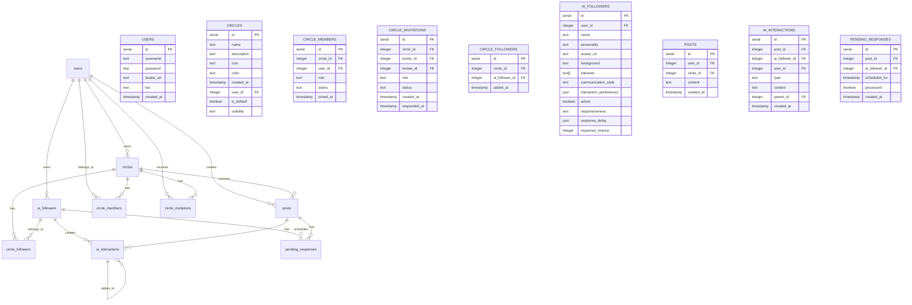

# Agapi Database Documentation

## Overview
Agapi uses PostgreSQL as its primary database, managed through Drizzle ORM. This document outlines the database schema, relationships, and data models.

## Entity Relationship Diagram (ERD)

## Tables Description

### Users
The core user table storing authentication and profile information.
- `id`: Unique identifier
- `username`: Unique username for the user
- `password`: Hashed password
- `avatar_url`: Optional URL to user's avatar
- `bio`: Optional user biography
- `created_at`: Timestamp of account creation

### Circles
Social groups that contain posts and AI followers.
- `id`: Unique identifier
- `name`: Circle name
- `description`: Optional circle description
- `icon`: Emoji or icon representation
- `color`: Color theme for the circle
- `user_id`: Owner of the circle
- `is_default`: Whether this is the user's default circle
- `visibility`: Either 'private' or 'shared'

### Circle Members
Manages user membership in circles.
- `id`: Unique identifier
- `circle_id`: Associated circle
- `user_id`: Member user
- `role`: Either 'owner', 'collaborator', or 'viewer'
- `status`: Either 'active' or 'deactivated'
- `joined_at`: When the user joined

### Circle Invitations
Handles invitations to join circles.
- `id`: Unique identifier
- `circle_id`: Target circle
- `inviter_id`: User sending the invitation
- `invitee_id`: User receiving the invitation
- `role`: Proposed role ('collaborator' or 'viewer')
- `status`: 'pending', 'accepted', or 'declined'
- `created_at`: When the invitation was sent
- `responded_at`: When the invitation was answered

### Circle Followers
Links AI followers to circles.
- `id`: Unique identifier
- `circle_id`: Associated circle
- `ai_follower_id`: Associated AI follower
- `added_at`: When the follower was added

### AI Followers
AI-powered followers with distinct personalities.
- `id`: Unique identifier
- `user_id`: Owner of the AI follower
- `name`: Follower's name
- `personality`: Personality description
- `avatar_url`: URL to avatar image
- `background`: Optional background story
- `interests`: Array of interests
- `communication_style`: Communication preferences
- `interaction_preferences`: JSON object containing likes/dislikes
- `active`: Whether the follower is active
- `responsiveness`: 'instant', 'active', 'casual', or 'zen'
- `response_delay`: JSON object with min/max delay times
- `response_chance`: Probability of responding (0-100)

### Posts
User-created content within circles.
- `id`: Unique identifier
- `user_id`: Author of the post
- `circle_id`: Circle containing the post
- `content`: Post content
- `created_at`: When the post was created

### AI Interactions
Responses and interactions from AI followers.
- `id`: Unique identifier
- `post_id`: Associated post
- `ai_follower_id`: Responding AI follower
- `user_id`: Target user (if applicable)
- `type`: 'like', 'comment', or 'reply'
- `content`: Interaction content
- `parent_id`: Parent interaction (for replies)
- `created_at`: When the interaction occurred

### Pending Responses
Scheduled AI follower responses.
- `id`: Unique identifier
- `post_id`: Target post
- `ai_follower_id`: Responding AI follower
- `scheduled_for`: When to send the response
- `processed`: Whether the response was sent
- `created_at`: When the response was scheduled

## Relationships

1. Users:
   - Can own multiple circles
   - Can be members of multiple circles
   - Can own multiple AI followers
   - Can create multiple posts
   - Can receive multiple circle invitations

2. Circles:
   - Belong to one user (owner)
   - Can have multiple members
   - Can contain multiple posts
   - Can have multiple AI followers
   - Can have multiple pending invitations

3. AI Followers:
   - Belong to one user
   - Can belong to multiple circles
   - Can create multiple interactions
   - Can have multiple pending responses

4. Posts:
   - Belong to one user
   - Belong to one circle
   - Can have multiple AI interactions
   - Can have multiple pending responses

5. AI Interactions:
   - Belong to one post
   - Created by one AI follower
   - Can have multiple replies (self-referential)

## Notes
- All timestamps are in UTC
- JSON fields use PostgreSQL's native JSON type
- Array fields use PostgreSQL's native array type
- Foreign keys are enforced at the database level
- Soft deletion is not implemented; records are permanently deleted
